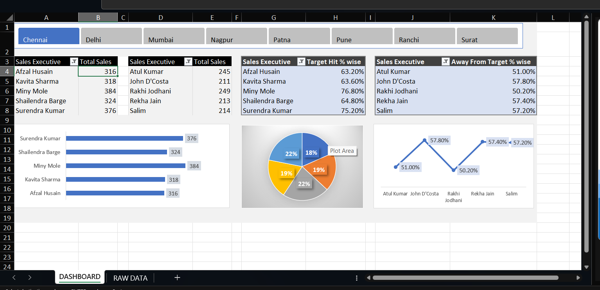

# 📊 Sales Dashboard Using Excel

## 📌 Project Overview

The **Sales Dashboard Using Excel** project is designed to analyze and visualize sales performance using Microsoft Excel.
This dashboard provides clear insights into sales trends, employee performance, and regional sales distribution through interactive charts and data analysis.

The goal of this project is to demonstrate **data analysis and visualization skills using Excel**, which are essential for **Data Analyst roles**.

---

## 🎯 Objectives

* Analyze sales data efficiently
* Track employee performance
* Identify high-performing cities
* Visualize sales trends using charts
* Build an interactive dashboard for quick decision-making

---

## 📂 Dataset Description

The dataset used in this project contains the following fields:

| Column Name | Description                |
| ----------- | -------------------------- |
| emp_id      | Unique ID of employee      |
| name        | Employee name              |
| city        | City where sales were made |
| day1 - day5 | Daily sales values         |
| total_sales | Total sales by employee    |

---

## 🛠 Tools & Technologies Used

* **Microsoft Excel**
* Pivot Tables
* Pivot Charts
* Excel Formulas
* Data Cleaning
* Data Visualization

---

## 📊 Dashboard Features

The dashboard provides the following insights:

* 📈 **Total Sales Overview**
* 🏙 **Sales by City**
* 👨‍💼 **Employee Performance Analysis**
* 📅 **Daily Sales Trends**
* 📊 Interactive Charts and Visualizations

---

## 📷 Dashboard Preview

---

## 📁 Project Files

| File Name                    | Description             |
| ---------------------------- | ----------------------- |
| Sales-Dashboard-Project.xlsx | Excel dashboard project |
| Sales-Dashboard-Image.png    | Dashboard screenshot    |
| README.md                    | Project documentation   |

---

## 🚀 How to Use

1. Download the repository.
2. Open the file **Sales-Dashboard-Project.xlsx**.
3. Explore the dashboard and analyze the sales insights.

---

## 💡 Key Learnings

Through this project I learned:

* Data cleaning and preparation
* Creating Pivot Tables and Charts
* Building interactive dashboards
* Presenting data insights visually

---

## 👨‍💻 Author

**Pratyaksha Kumar**

🎓 BCA Student | Aspiring Data Analyst

📧 Email: [pratyakshkumar35@gmail.com](mailto:pratyakshkumar35@gmail.com)
🔗 LinkedIn: https://www.linkedin.com/in/pratyaksha-kumar-26b4ab348/

---

⭐ If you like this project, consider giving it a **star** on GitHub!
